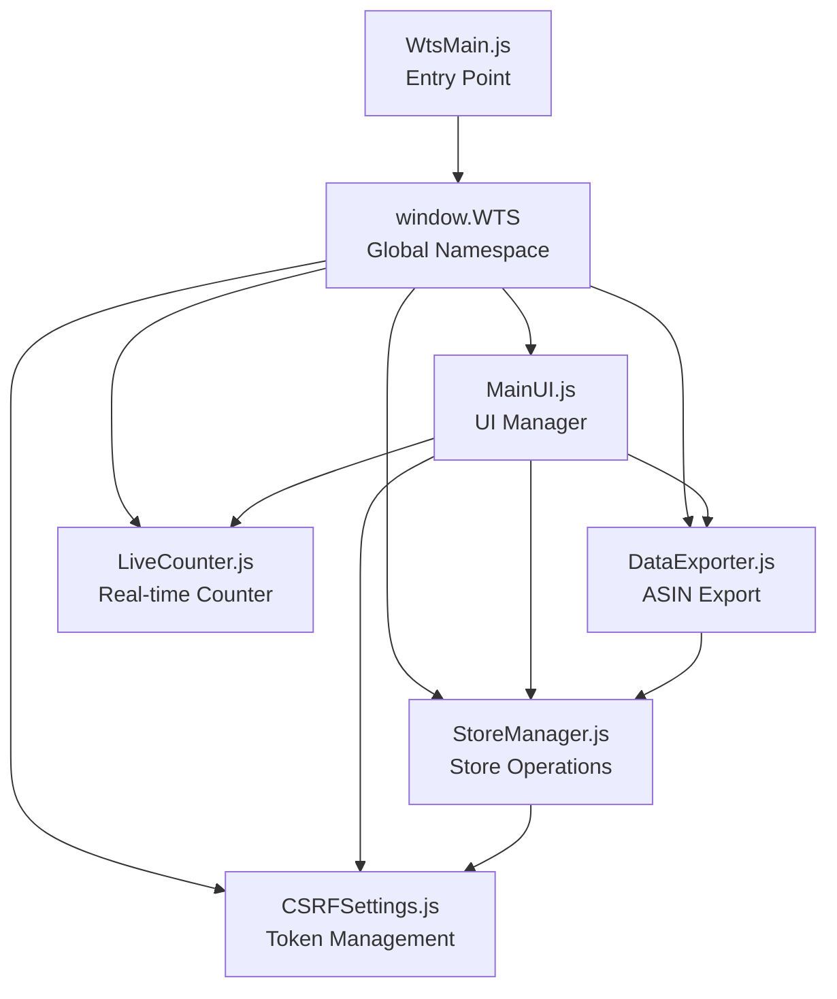
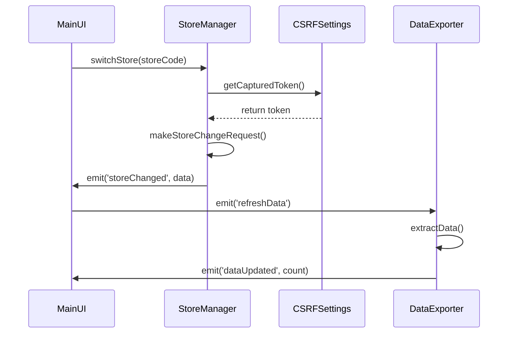
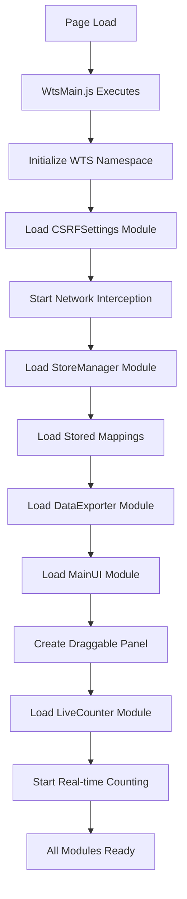

# WTS Tampermonkey Script - Modular Architecture Document

## Executive Summary

This document outlines the technical architecture for refactoring the monolithic [`WtsMain.js`](WtsMain.js) Tampermonkey script into 6 modular components using a namespace pattern. The architecture addresses scope isolation, component communication, shared state management, and Tampermonkey-specific challenges.

## Architecture Overview

### Core Design Principles

1. **Namespace Pattern**: Single global `window.WTS` object containing all modules
2. **Controlled Scope**: Each module maintains private state while exposing public APIs
3. **Centralized Storage**: Unified Tampermonkey storage access patterns
4. **Standardized Logging**: Consistent `[FileName] [FunctionName]` format
5. **Event-Driven Communication**: Modules communicate through the central WTS object

### Module Structure



## Detailed Component Architecture

### 1. WtsMain.js - Entry Point & Orchestrator

**Responsibilities:**
- Tampermonkey metadata and @require declarations
- Initialize global WTS namespace
- Bootstrap all modules in correct order
- Handle page load events

**Structure:**
```javascript
// ==UserScript==
// @name         Whole Foods ASIN Exporter with Store Mapping
// @require      https://raw.githubusercontent.com/RynAgain/WTS-TM-Scripts/beta/MainUI.js
// @require      https://raw.githubusercontent.com/RynAgain/WTS-TM-Scripts/beta/StoreManager.js
// @require      https://raw.githubusercontent.com/RynAgain/WTS-TM-Scripts/beta/DataExporter.js
// @require      https://raw.githubusercontent.com/RynAgain/WTS-TM-Scripts/beta/CSRFSettings.js
// @require      https://raw.githubusercontent.com/RynAgain/WTS-TM-Scripts/beta/LiveCounter.js
// ==/UserScript==

(function() {
    'use strict';
    
    // Initialize global namespace
    window.WTS = {
        modules: {},
        shared: {},
        storage: {},
        logger: {},
        events: {}
    };
    
    // Bootstrap modules
    WTS.init();
})();
```

### 2. MainUI.js - Central UI Manager

**Responsibilities:**
- Draggable panel creation and management
- Button event coordination
- UI state persistence
- Module UI integration

**Key Features:**
- Drag and drop functionality
- Panel position persistence
- Button state management
- Modal coordination

**Public API:**
```javascript
WTS.modules.MainUI = {
    createPanel: function(),
    addButton: function(config),
    showModal: function(content),
    updateButtonState: function(buttonId, state),
    savePosition: function()
};
```

### 3. StoreManager.js - Store Operations

**Responsibilities:**
- Store mapping data management
- Store switching functionality
- CSV parsing and validation
- CSRF token integration for store changes

**Key Features:**
- Store mapping persistence
- CSV file upload handling
- Store switching with CSRF validation
- Network request management

**Public API:**
```javascript
WTS.modules.StoreManager = {
    loadMappings: function(),
    saveMappings: function(mappings),
    switchStore: function(storeCode),
    parseCSV: function(csvText),
    getStoreList: function()
};
```

### 4. DataExporter.js - ASIN Data Management

**Responsibilities:**
- ASIN card extraction
- CSV generation and download
- Data validation and formatting
- Export state management

**Key Features:**
- DOM parsing for ASIN cards
- CSV formatting with proper escaping
- Empty card detection
- Data refresh capabilities

**Public API:**
```javascript
WTS.modules.DataExporter = {
    extractData: function(),
    downloadCSV: function(data),
    refreshData: function(),
    getLastExtracted: function()
};
```

### 5. CSRFSettings.js - Token Management

**Responsibilities:**
- CSRF token capture and storage
- Network request interception
- Token validation and fallback
- Settings modal management

**Key Features:**
- Multi-method token extraction
- Network interception (XMLHttpRequest & fetch)
- Token age validation
- Fallback token management

**Public API:**
```javascript
WTS.modules.CSRFSettings = {
    startInterception: function(),
    getCapturedToken: function(),
    extractToken: function(),
    showSettingsModal: function(),
    validateToken: function(token)
};
```

### 6. LiveCounter.js - Real-time Display

**Responsibilities:**
- Real-time ASIN counting
- Mutation observer management
- Counter display updates
- Performance optimization

**Key Features:**
- Efficient DOM monitoring
- Throttled updates
- Counter display integration
- Memory leak prevention

**Public API:**
```javascript
WTS.modules.LiveCounter = {
    startCounting: function(),
    stopCounting: function(),
    updateDisplay: function(),
    getCurrentCount: function()
};
```

## Scope Isolation Strategy

### Namespace Structure

```javascript
window.WTS = {
    // Module containers
    modules: {
        MainUI: {},
        StoreManager: {},
        DataExporter: {},
        CSRFSettings: {},
        LiveCounter: {}
    },
    
    // Shared utilities and state
    shared: {
        storage: {},      // Tampermonkey storage wrappers
        logger: {},       // Standardized logging
        utils: {},        // Common utilities
        state: {}         // Cross-module state
    },
    
    // Event system for module communication
    events: {
        emit: function(event, data),
        on: function(event, callback),
        off: function(event, callback)
    }
};
```

### Module Isolation Pattern

Each module follows this pattern:
```javascript
(function() {
    'use strict';
    
    // Private module scope
    let privateState = {};
    let privateConfig = {};
    
    // Private functions
    function privateFunction() {
        WTS.shared.logger.log('ModuleName', 'privateFunction', 'Message');
    }
    
    // Public API
    WTS.modules.ModuleName = {
        // Public methods only
        publicMethod: function() {
            return privateFunction();
        }
    };
    
    // Module initialization
    WTS.modules.ModuleName.init = function() {
        // Module-specific initialization
    };
})();
```

## Shared State Management

### Storage Abstraction Layer

```javascript
WTS.shared.storage = {
    set: function(key, value) {
        try {
            GM_setValue(key, JSON.stringify(value));
            WTS.shared.logger.log('Storage', 'set', `Key: ${key}`);
        } catch (error) {
            WTS.shared.logger.error('Storage', 'set', error.message);
        }
    },
    
    get: function(key, defaultValue) {
        try {
            const value = GM_getValue(key, null);
            return value ? JSON.parse(value) : defaultValue;
        } catch (error) {
            WTS.shared.logger.error('Storage', 'get', error.message);
            return defaultValue;
        }
    },
    
    delete: function(key) {
        GM_deleteValue(key);
        WTS.shared.logger.log('Storage', 'delete', `Key: ${key}`);
    }
};
```

### Cross-Module State

```javascript
WTS.shared.state = {
    // CSRF token state
    csrf: {
        capturedToken: null,
        lastCaptured: null,
        fallbackToken: null
    },
    
    // Store mapping state
    stores: {
        mappings: new Map(),
        currentStore: null
    },
    
    // Export data state
    export: {
        lastExtracted: [],
        lastCount: 0
    },
    
    // UI state
    ui: {
        panelPosition: { x: 10, y: 10 },
        panelVisible: true
    }
};
```

## Component Communication Patterns

### Event-Driven Communication

```javascript
WTS.events = {
    listeners: {},
    
    emit: function(event, data) {
        if (this.listeners[event]) {
            this.listeners[event].forEach(callback => {
                try {
                    callback(data);
                } catch (error) {
                    WTS.shared.logger.error('Events', 'emit', `Event: ${event}, Error: ${error.message}`);
                }
            });
        }
    },
    
    on: function(event, callback) {
        if (!this.listeners[event]) {
            this.listeners[event] = [];
        }
        this.listeners[event].push(callback);
    },
    
    off: function(event, callback) {
        if (this.listeners[event]) {
            this.listeners[event] = this.listeners[event].filter(cb => cb !== callback);
        }
    }
};
```

### Communication Flow Examples



## Initialization Flow

### Bootstrap Sequence



### Initialization Code

```javascript
WTS.init = function() {
    const initSequence = [
        'CSRFSettings',
        'StoreManager', 
        'DataExporter',
        'MainUI',
        'LiveCounter'
    ];
    
    initSequence.forEach(moduleName => {
        if (WTS.modules[moduleName] && WTS.modules[moduleName].init) {
            try {
                WTS.modules[moduleName].init();
                WTS.shared.logger.log('WTS', 'init', `${moduleName} initialized`);
            } catch (error) {
                WTS.shared.logger.error('WTS', 'init', `${moduleName} failed: ${error.message}`);
            }
        }
    });
    
    WTS.events.emit('systemReady');
};
```

## Logging Standards

### Standardized Logger

```javascript
WTS.shared.logger = {
    log: function(fileName, functionName, message) {
        console.log(`[${fileName}] [${functionName}] ${message}`);
    },
    
    error: function(fileName, functionName, message) {
        console.error(`[${fileName}] [${functionName}] ERROR: ${message}`);
    },
    
    warn: function(fileName, functionName, message) {
        console.warn(`[${fileName}] [${functionName}] WARNING: ${message}`);
    },
    
    debug: function(fileName, functionName, message) {
        if (WTS.shared.config.debugMode) {
            console.debug(`[${fileName}] [${functionName}] DEBUG: ${message}`);
        }
    }
};
```

### Usage Examples

```javascript
// In StoreManager.js
WTS.shared.logger.log('StoreManager', 'switchStore', `Switching to store: ${storeCode}`);
WTS.shared.logger.error('StoreManager', 'parseCSV', `Invalid CSV format: ${error.message}`);

// In CSRFSettings.js  
WTS.shared.logger.log('CSRFSettings', 'extractToken', 'Token extraction started');
WTS.shared.logger.warn('CSRFSettings', 'getCapturedToken', 'Token is older than 24 hours');
```

## Mutation Observer Strategy

### Centralized Observer Management

```javascript
WTS.shared.observers = {
    active: new Map(),
    
    create: function(target, config, callback, name) {
        const observer = new MutationObserver(callback);
        observer.observe(target, config);
        this.active.set(name, observer);
        WTS.shared.logger.log('Observers', 'create', `Observer '${name}' created`);
        return observer;
    },
    
    destroy: function(name) {
        const observer = this.active.get(name);
        if (observer) {
            observer.disconnect();
            this.active.delete(name);
            WTS.shared.logger.log('Observers', 'destroy', `Observer '${name}' destroyed`);
        }
    },
    
    destroyAll: function() {
        this.active.forEach((observer, name) => {
            observer.disconnect();
            WTS.shared.logger.log('Observers', 'destroyAll', `Observer '${name}' destroyed`);
        });
        this.active.clear();
    }
};
```

### Observer Placement Strategy

- **LiveCounter**: Document body observer for ASIN card changes
- **MainUI**: Panel container observer for dynamic content
- **StoreManager**: Form observer for store selection changes
- **DataExporter**: Carousel observer for new card detection

## Tampermonkey Storage Patterns

### Storage Key Conventions

```javascript
WTS.shared.storage.keys = {
    // CSRF related
    CSRF_TOKEN: 'wts_csrf_captured_token',
    CSRF_TIMESTAMP: 'wts_csrf_timestamp', 
    CSRF_FALLBACK: 'wts_csrf_fallback_token',
    CSRF_USE_FALLBACK: 'wts_csrf_use_fallback',
    
    // Store mapping
    STORE_MAPPINGS: 'wts_store_mappings',
    CURRENT_STORE: 'wts_current_store',
    
    // UI state
    PANEL_POSITION: 'wts_panel_position',
    PANEL_VISIBLE: 'wts_panel_visible',
    
    // Export data
    LAST_EXPORT_DATA: 'wts_last_export_data',
    EXPORT_SETTINGS: 'wts_export_settings'
};
```

### Storage Access Patterns

```javascript
// Module-specific storage helpers
WTS.modules.StoreManager.storage = {
    saveMappings: function(mappings) {
        const data = Object.fromEntries(mappings);
        WTS.shared.storage.set(WTS.shared.storage.keys.STORE_MAPPINGS, data);
    },
    
    loadMappings: function() {
        const data = WTS.shared.storage.get(WTS.shared.storage.keys.STORE_MAPPINGS, {});
        return new Map(Object.entries(data));
    }
};
```

## Error Handling and Recovery

### Global Error Handler

```javascript
WTS.shared.errorHandler = {
    handle: function(error, context) {
        const errorInfo = {
            message: error.message,
            stack: error.stack,
            context: context,
            timestamp: new Date().toISOString(),
            url: window.location.href
        };
        
        WTS.shared.logger.error('ErrorHandler', 'handle', JSON.stringify(errorInfo));
        
        // Store error for debugging
        WTS.shared.storage.set('wts_last_error', errorInfo);
        
        // Emit error event for modules to handle
        WTS.events.emit('error', errorInfo);
    }
};

// Global error catching
window.addEventListener('error', (event) => {
    WTS.shared.errorHandler.handle(event.error, 'Global Error');
});
```

## Performance Considerations

### Module Loading Optimization

1. **Lazy Loading**: Non-critical modules load after initial UI
2. **Throttling**: Limit observer callbacks and API calls
3. **Memory Management**: Proper cleanup of event listeners and observers
4. **Caching**: Store frequently accessed data in memory

### Resource Management

```javascript
WTS.shared.performance = {
    throttle: function(func, delay) {
        let timeoutId;
        let lastExecTime = 0;
        return function (...args) {
            const currentTime = Date.now();
            
            if (currentTime - lastExecTime > delay) {
                func.apply(this, args);
                lastExecTime = currentTime;
            } else {
                clearTimeout(timeoutId);
                timeoutId = setTimeout(() => {
                    func.apply(this, args);
                    lastExecTime = Date.now();
                }, delay - (currentTime - lastExecTime));
            }
        };
    },
    
    debounce: function(func, delay) {
        let timeoutId;
        return function (...args) {
            clearTimeout(timeoutId);
            timeoutId = setTimeout(() => func.apply(this, args), delay);
        };
    }
};
```

## Security Considerations

### CSRF Token Security

1. **Token Validation**: Verify token format and age
2. **Secure Storage**: Use Tampermonkey's secure storage
3. **Network Interception**: Minimize exposure of token capture
4. **Fallback Management**: Secure fallback token handling

### Content Security Policy

1. **Inline Script Avoidance**: All code in external files
2. **Dynamic Content**: Sanitize any dynamic HTML content
3. **Network Requests**: Validate all external requests

## Testing Strategy

### Module Testing

Each module should include:
- Unit tests for public API methods
- Integration tests for cross-module communication
- Error handling tests
- Performance benchmarks

### Testing Utilities

```javascript
WTS.shared.testing = {
    mockStorage: function() {
        // Mock GM_setValue, GM_getValue for testing
    },
    
    mockDOM: function() {
        // Mock DOM elements for testing
    },
    
    assertModule: function(moduleName) {
        // Verify module structure and API
    }
};
```

## Migration Strategy

### Phase 1: Infrastructure Setup
1. Create WTS namespace structure
2. Implement shared utilities (storage, logging, events)
3. Set up error handling and performance utilities

### Phase 2: Core Module Migration
1. Extract CSRFSettings module (network interception)
2. Extract StoreManager module (store operations)
3. Extract DataExporter module (ASIN processing)

### Phase 3: UI and Integration
1. Extract MainUI module (panel and buttons)
2. Extract LiveCounter module (real-time display)
3. Update WtsMain.js as orchestrator

### Phase 4: Testing and Optimization
1. Integration testing across all modules
2. Performance optimization
3. Error handling validation
4. Documentation updates

## Conclusion

This modular architecture provides:

✅ **Scope Isolation**: Clear namespace boundaries prevent conflicts  
✅ **Maintainability**: Separated concerns enable easier updates  
✅ **Testability**: Modular structure supports unit testing  
✅ **Extensibility**: New features can be added as modules  
✅ **Performance**: Optimized loading and resource management  
✅ **Security**: Proper token handling and validation  

The namespace pattern with controlled access provides the ideal balance of modularity and simplicity for the Tampermonkey environment, addressing all identified scope challenges while maintaining the script's functionality.